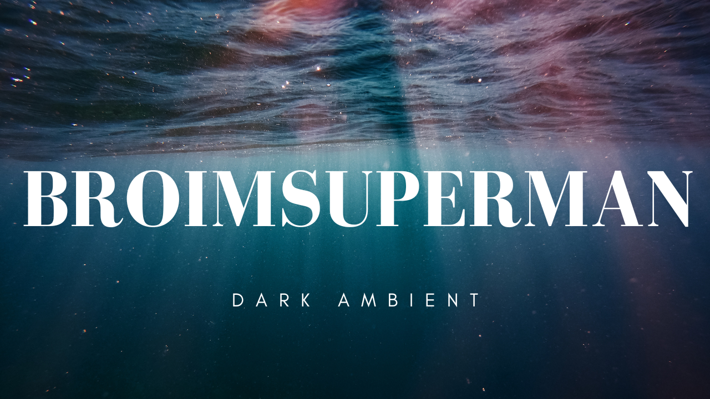
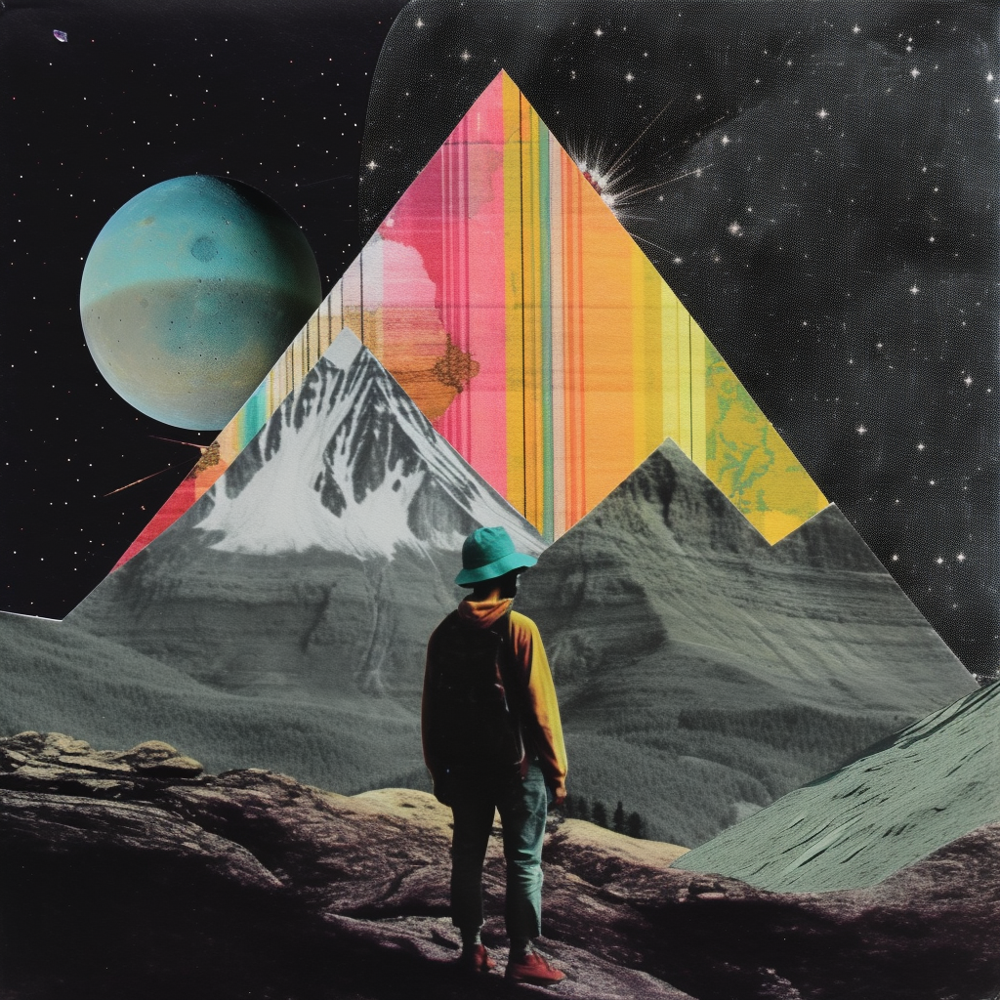
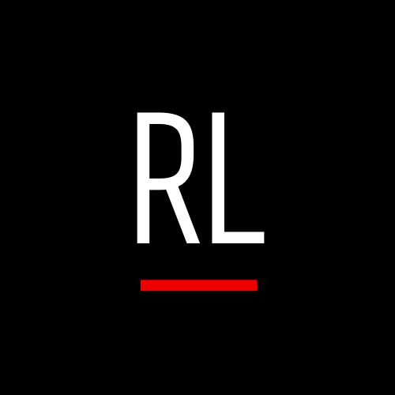
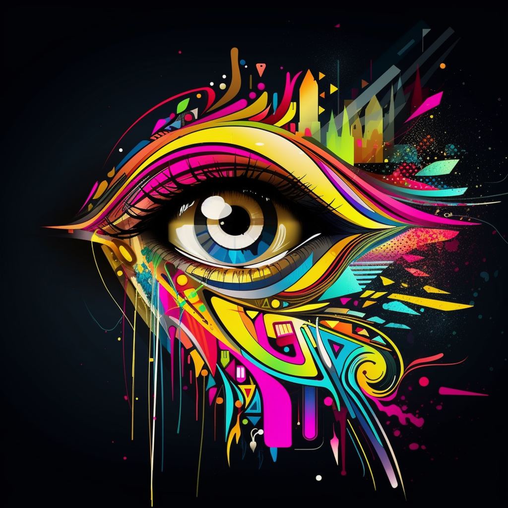

# My GFX/Banner and Logo Design Portfolio

Welcome to my portfolio showcasing my GFX/banner and logo design skills! Below you'll find a selection of my favorite designs.

## Banner Designs

### Banner 1

### Banner 2

### Banner 3

## GFX Designs

### GFX 1

### GFX 2

### GFX 3

## Logo Designs

### Logo 1

### Logo 2

### Logo 3

## Some extra work I've done over the last few months

### Showcase 1

### Showcase 2

### Showcase 3

### Showcase 4

### Showcase 5

### Showcase 6 (sticker designs in a grid)

### Showcase 7 

### Showcase 8

### Showcase 9

## About Me

I am a skilled graphic designer with experience in creating beautiful and eye-catching banners, logos, and GFX designs. I have a passion for creating visually stunning designs that capture the attention of viewers and leave a lasting impression. My work is always high quality, and I take pride in delivering projects on time and within budget.

If you're interested in working with me or have any questions, please don't hesitate to reach out. I look forward to hearing from you!
